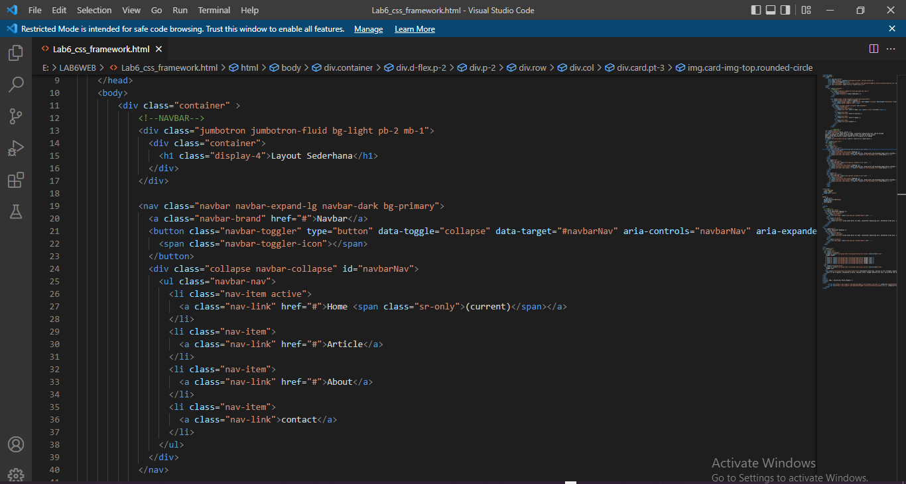

# Lab6Web

NAMA    : MUHAMMAD FERDI HERDIANSYAH
NIM     : 312010038
KELAS   : TI.20 D1
MATA PEL : PEMOGRAMAN WEB ( Prak. 6 - Web framework )
DOSEN   : Agung Nugroho,S.Kom.,M.Kom., 

1. Buatlah folder baru dengan nama lab6_css_framework, kemudian buat dokumen baru html

2. Buat layout web sederhana menggunakan css frameword (Twitter Bootsrtap).

==> Quick start Buka web https://getbootstrap.com Disini saya memakai Bootstrap 4. Copy atau download CSS & JS Bootstrap.

==> Navbar (navigasi) Buat komponen website yang berupa menu. yang biasanya diletakkan pada header website. Untuk mencari component klik menu documentation pada web bootstrap.

TAMPILAN BROWSER

==> umbotron (satu element yang dibuat untuk tujuan membuat semacam pengumuman,konten khusus atau informasi tentang halaman website) Buat jumbotron atau area besar pada Bootstrap, umumnya digunakan untuk menampilkan sebuah infromasi penting.

Tampilan Browser

==>  Cards (1) Untuk membuat body konten, saya menggunakan cards. pertama saya akan membagi kolom menggunakan display flex agar dapat memuat 2 kolom yang nanti akan di isi oleh menu List Group.

Penjelasan :

col memberi style sebuah table berdasarkan kolom tertentu

img-rounded-circle untuk membuat border pada gambar menjadi bulat

pt-3 padding top = 3

mt-3 margin top = 3

saya disini akan menambah style untuk mengatur ukuran dan posisi pada gambar.

Tampilan Browser

==> List Group menambahkan widget disamping kanan cards 1

Tampilan Browser

==> Cards 2

Tampilan Browser

